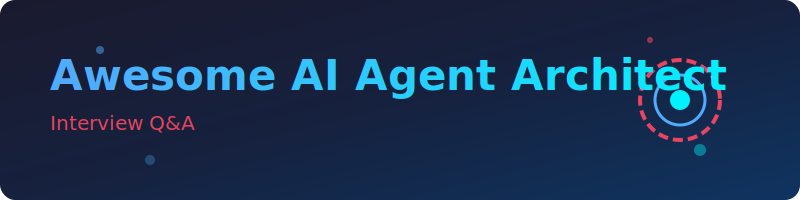

# Awesome AI Agent Architect Interview Q&A 🤖🕸️🧭

<p align="center">
  
</p>

<a href="https://github.com/ishandutta2007/Awesome-Awesome-Awesome"></a><a href="https://discord.gg/jc4xtF58Ve"></a>[](https://awesome.re)
[](CONTRIBUTING.md)
[](LICENSE)<a href="https://github.com/ishandutta2007"></a>

✨ A curated, no-fluff collection of **AI Agent Architect interview questions with answers**, organized by topic. This comprehensive guide is built for candidates prepping for AI Agent Architect, Agentic AI Engineer, LLM Application Architect, and Multi-Agent Systems Engineer roles. It covers key concepts like LLM orchestration, function calling, agentic RAG, memory systems, and multi-agent frameworks, making it the ultimate resource for interview preparation and for interviewers building question banks.

> 📎 **Scope note:** "AI Agent Architect" here refers to the role — increasingly distinct as of 2025-2026 — that designs and builds **agentic AI systems**: LLM-driven agents that plan, use tools, maintain memory, and often coordinate with other agents to accomplish multi-step tasks with a degree of autonomy. This is a different (complementary) focus from the [Awesome-AIOps-Engineer-Interview-QA](https://github.com/ishandutta2007/Awesome-AIOps-Engineer-Interview-QA) repo in this series, which covers *operating* AI/ML/LLM systems in production infrastructure — this repo instead covers *designing the agent's architecture itself*: how it reasons, plans, uses tools, remembers, coordinates with other agents, and stays safe and controllable while doing so.

🎯 Every answer aims to be **concise, correct, and interview-ready** — the kind of answer that would actually land well in a 45-minute technical round, not a textbook chapter.

> ⭐ Star this repo if it helps your prep. PRs adding new questions, fixing answers, or improving explanations are very welcome — see [CONTRIBUTING.md](CONTRIBUTING.md).

---

## 📚 Table of Contents

| # | Topic | Questions | Difficulty Mix |
|---|-------|-----------|-----------------|
| 01 | [Agent Fundamentals & Architecture Patterns](topics/01-agent-fundamentals-architecture.md) | 12 | Easy → Medium |
| 02 | [Tool Use & Function Calling](topics/02-tool-use-function-calling.md) | 11 | Medium → Hard |
| 03 | [Planning, Reasoning & Task Decomposition](topics/03-planning-reasoning-task-decomposition.md) | 10 | Medium → Hard |
| 04 | [Memory Systems for Agents](topics/04-memory-systems.md) | 10 | Medium → Hard |
| 05 | [Multi-Agent Systems & Orchestration](topics/05-multi-agent-orchestration.md) | 11 | Medium → Hard |
| 06 | [Agentic RAG & Knowledge Integration](topics/06-agentic-rag-knowledge.md) | 10 | Medium → Hard |
| 07 | [Agent Frameworks & Ecosystem](topics/07-agent-frameworks-ecosystem.md) | 9 | Easy → Medium |
| 08 | [Evaluation & Testing of Agentic Systems](topics/08-evaluation-testing-agents.md) | 10 | Medium → Hard |
| 09 | [Safety, Guardrails & Human-in-the-Loop](topics/09-safety-guardrails-hitl.md) | 10 | Medium → Hard |
| 10 | [Agent Observability & Debugging](topics/10-agent-observability-debugging.md) | 9 | Medium → Hard |
| 11 | [Deployment & Scaling of Agent Systems](topics/11-deployment-scaling-agents.md) | 10 | Medium → Hard |
| 12 | [Security for Autonomous Agents](topics/12-security-autonomous-agents.md) | 10 | Medium → Hard |
| 13 | [Scenario-based & Behavioral](topics/13-scenario-behavioral.md) | 11 | Medium → Hard |

📈 **Total: 133 questions** in v1, growing with community contributions.

---

## 🧭 How to Use This Repo

- **Cramming for an interview next week?** Start with the topic weighted heaviest for your target role (see below), and read the "Follow-up" notes — interviewers almost always dig deeper.
- **Deep prep over weeks?** Work through every file top to bottom — for architecture-heavy topics (multi-agent orchestration, memory systems), try sketching or building a small working prototype rather than only reading the answer.
- **Interviewing candidates?** Use these as a base question bank — mix easy/medium/hard per round, and use the scenario/behavioral questions to gauge system-design judgment, not just framework familiarity.

### 🎯 Suggested focus by role

| 🧑‍💻 Role | 🎯 Prioritize |
|------|------------|
| AI Agent Architect (generalist) | Agent Fundamentals, Multi-Agent Orchestration, Safety/Guardrails, Evaluation |
| Agentic AI Engineer (builder) | Tool Use/Function Calling, Planning/Reasoning, Agent Frameworks, Memory Systems |
| Multi-Agent Systems Engineer | Multi-Agent Orchestration, Planning/Reasoning, Observability/Debugging |
| LLM Application Architect | Agentic RAG, Agent Frameworks, Deployment/Scaling, Memory Systems |
| AI Safety/Trust Engineer (agents) | Safety/Guardrails/HITL, Security for Autonomous Agents, Evaluation |
| Platform Engineer (agent infra) | Deployment/Scaling, Observability/Debugging, Agent Frameworks |

---

## 🗂️ Repo Structure

```
Awesome-AI-Agent-Architect-Interview-QA/
├── README.md                 ← you are here
├── CONTRIBUTING.md
├── LICENSE
└── topics/
    ├── 01-agent-fundamentals-architecture.md
    ├── 02-tool-use-function-calling.md
    ├── 03-planning-reasoning-task-decomposition.md
    ├── 04-memory-systems.md
    ├── 05-multi-agent-orchestration.md
    ├── 06-agentic-rag-knowledge.md
    ├── 07-agent-frameworks-ecosystem.md
    ├── 08-evaluation-testing-agents.md
    ├── 09-safety-guardrails-hitl.md
    ├── 10-agent-observability-debugging.md
    ├── 11-deployment-scaling-agents.md
    ├── 12-security-autonomous-agents.md
    └── 13-scenario-behavioral.md
```

## 🛣️ Roadmap (v2+)

- [ ] Add "Framework tags" (which questions map to specific tools — LangGraph, AutoGen, CrewAI, OpenAI Agents SDK, Google ADK, etc.)
- [ ] Add a `/mock-interviews` folder with full simulated agent architecture design sessions
- [ ] Add difficulty badges per question
- [ ] Add worked example architecture diagrams for common agent patterns (ReAct, planner-executor, hierarchical multi-agent)
- [ ] Add a companion cheat-sheet repo comparing agent framework capabilities and design tradeoffs
- [ ] Community-submitted "how I answered this in a real interview" notes

## 🤝 Contributing

This is meant to be a living, community-curated resource. See [CONTRIBUTING.md](CONTRIBUTING.md) for the format to follow when submitting a question.

## 📄 License

Content is released under the [MIT License](LICENSE) — free to use, fork, and adapt.

##  Star History
<div align="center">
<a href="https://www.star-history.com/?repos=ishandutta2007%2FAwesome-AI-Agent-Architect-Interview-QA&type=date&legend=bottom-right">
<picture>
<source media="(prefers-color-scheme: dark)" srcset="https://api.star-history.com/chart?repos=ishandutta2007/Awesome-AI-Agent-Architect-Interview-QA&type=date&theme=dark&legend=bottom-right" />
<source media="(prefers-color-scheme: light)" srcset="https://api.star-history.com/chart?repos=ishandutta2007/Awesome-AI-Agent-Architect-Interview-QA&type=date&legend=bottom-right" />

</picture>
</a>
</div>

---

*Maintained by [@ishandutta2007](https://github.com/ishandutta2007). Part of a series of "Awesome" curated technical resources.*
